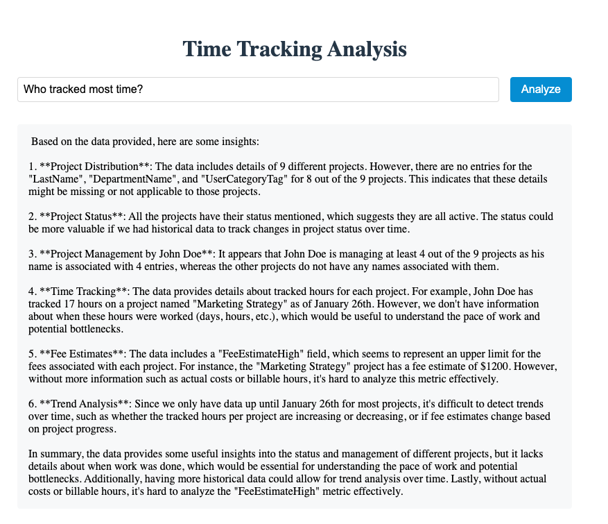

# AI Time Tracking Analysis App

An AI-powered application for analyzing time tracking data using natural language queries. The app combines modern web technologies with the Mistral AI model to provide intelligent insights into project time management data.



## Technical Architecture

### Frontend Application (React + Vite)

The frontend is built using React and Vite, featuring:

- **Modern UI Components**: Styled using `@emotion/styled` for maintainable CSS-in-JS
- **Responsive Design**: Mobile-friendly interface with clean, modern aesthetics
- **Real-time Feedback**: Loading states and error handling for better UX
- **Component Structure**:
  - Single-page application architecture
  - Controlled form components for user input
  - Styled components for consistent theming
  - Async state management for API interactions

### Backend Application (Node.js + Express)

The backend server implements:

- **Express.js Server**: RESTful API endpoints with CORS support
- **Data Processing**:
  - CSV parsing with `csv-parse`
  - Efficient data caching mechanism
  - Text similarity search for relevant records
- **API Endpoints**:
  - POST `/analyze`: Main analysis endpoint for processing queries
- **Error Handling**: Comprehensive error management with detailed responses

### AI Integration

The application uses the Mistral AI model through Ollama:

- **Model**: Mistral (via Ollama)
- **Features**:
  - Natural language understanding
  - Context-aware responses
  - Data pattern recognition
  - Numerical analysis capabilities
- **Integration**: Direct integration via Ollama's Node.js client

## Prerequisites

- Node.js (v18 or later)
- Ollama installed locally with the Mistral model
- npm or yarn

## Setup

1. Install Ollama and the Mistral model:
```bash
# Install Ollama (if not already installed)
curl https://ollama.ai/install.sh | sh

# Pull the Mistral model
ollama pull mistral
```

2. Install dependencies:
```bash
# Install frontend dependencies
cd frontend
npm install

# Install backend dependencies
cd ../backend
npm install
```

## Running the Application

1. Start the backend server:
```bash
cd backend
npm run dev
```

2. In a new terminal, start the frontend development server:
```bash
cd frontend
npm run dev
```

3. Open your browser and navigate to `http://localhost:3000`

## Usage Guide

1. **Enter Your Query**: Type natural language questions about the time tracking data
   - Example: "What are the total hours tracked for Project X in January?"
   - Example: "Show me the top billing rates by department"
   - Example: "Compare time estimates vs actual hours for completed projects"

2. **View Analysis**: The AI will process your query and provide:
   - Detailed analysis of relevant data
   - Statistical insights when applicable
   - Trends and patterns in the data
   - Recommendations based on the findings

## Data Structure

The application analyzes time tracking data with the following fields:

### Project Information
- `ClientName`: Client organization name
- `ProjectName`: Name of the project
- `ProjectStatus`: Current status (In-Progress, Completed, On-Hold)
- `PhaseName`: Project phase identifier
- `DeliverableName`: Specific deliverable name
- `MilestoneName`: Milestone identifier

### Time and Cost Tracking
- `EstimateInHours`: Estimated hours for the task
- `TrackedTimeInHours`: Actual hours spent
- `FeeEstimateHigh`: Estimated maximum fee
- `TrackedFee`: Actual fee charged
- `TrackedLaborCost`: Cost of labor
- `BillingRate`: Rate charged to client
- `LaborRate`: Internal labor cost rate

### Resource Information
- `SkillLevelName`: Skill level of the resource
- `SkillName`: Type of skill
- `FirstName`: Resource first name
- `LastName`: Resource last name
- `DepartmentName`: Department name
- `UserCategoryTag`: Resource category

### Additional Information
- `Comment`: Task description or notes
- `TrackedDate`: Date of time entry
